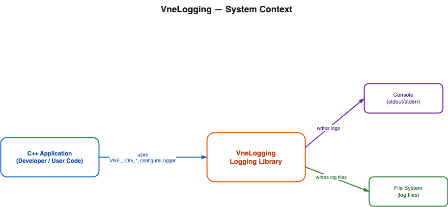
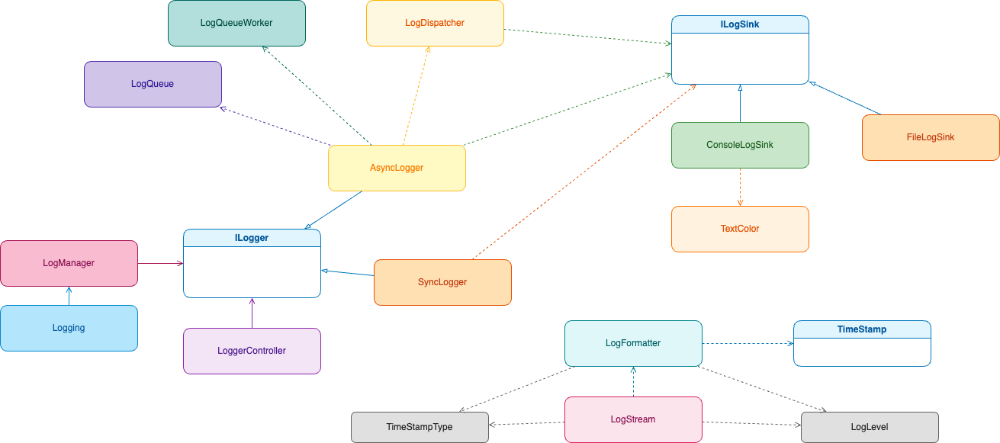
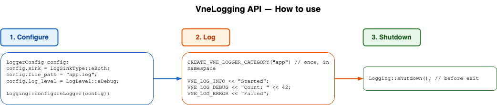

# Vertexnova Logging

## Overview

The VertexNova Logging provides a comprehensive, flexible, and efficient logging system for C++ applications. It supports multiple log sinks, configurable log levels, customizable formatting, and both synchronous and asynchronous logging operations.



**Figure 1: Context Diagram**

| Element | Description |
|---------|-------------|
| C++ Application | Developer/user code that uses `VNE_LOG_*` macros and `configureLogger` |
| VneLogging | Logging library; processes log messages and routes to sinks |
| Console | stdout/stderr; where formatted log messages are displayed |
| File System | Where log files are written (e.g. `app.log`) |

## Architecture

The logging system follows a layered architecture with clear separation of concerns:

- **Logging Interface Layer**: High-level API for application integration
- **Logger Management Layer**: Logger lifecycle and configuration management
- **Sink Layer**: Output destination management (console, file)
- **Formatting Layer**: Message formatting and timestamp handling
- **Queue Layer**: Asynchronous logging support



**Figure 2: Class Diagram**

| Element | Description |
|---------|-------------|
| Logging | Static setup interface; `configureLogger`, `initialize`, `shutdown` |
| LogManager | Singleton managing logger instances and lifecycle |
| LoggerController | Bridges configuration to logger creation |
| ILogger | Abstract logger interface; `log`, `flush`, `addLogSink` |
| SyncLogger | Synchronous logger; immediate output to sinks |
| AsyncLogger | Asynchronous logger; queue-based, non-blocking |
| ILogSink | Abstract output destination interface |
| ConsoleLogSink | Writes to console with level-based colors |
| FileLogSink | Writes to log files |
| LogQueue | Thread-safe message queue for async logging |
| LogQueueWorker | Background worker that drains the queue |
| LogDispatcher | Routes formatted messages to sinks |
| LogFormatter | Formats messages according to pattern (e.g. `%x`, `%l`, `%v`) |
| LogStream | Stream API for composing log messages with `<<` |
| TimeStamp | Timestamp generation and formatting |
| TextColor | Console color management per log level |
| LogLevel | Enum: eTrace, eDebug, eInfo, eWarn, eError, eFatal |
| TimeStampType | Timestamp type (local/UTC) |

## Key Components

### Core Classes

#### `Logging`

Main interface class providing static methods for logging system setup and configuration.

**Key Methods:**

- `initialize(logger_name, async)`: Initialize the logging system
- `shutdown()`: Clean shutdown of the logging system
- `getLogger(name)`: Retrieve a logger instance
- `addConsoleSink(logger_name)`: Add console output
- `addFileSink(logger_name, file)`: Add file output
- `setLogLevel(logger_name, level)`: Configure log level
- `setConsolePattern(logger_name, pattern)`: Set console formatting
- `setFilePattern(logger_name, pattern)`: Set file formatting
- `configureLogger(config)`: Configure a logger in a single step

#### `LogManager`

Singleton class managing logger instances and their lifecycle.

**Responsibilities:**

- Logger registration and retrieval
- Global configuration management
- Logger factory operations

#### `ILogger` Interface

Abstract base class defining the logger interface.

**Key Methods:**

- `log(category_name, level, time_stamp_type, message, file, function, line)`: Core logging operation
- `addLogSink(sink)`: Add output destination
- `getLogSinks()`: Retrieve list of log sinks
- `setCurrentLogLevel(level)`: Set minimum log level
- `getCurrentLogLevel()`: Get current log level
- `flush()`: Force output flush
- `getName()`: Get logger name
- `clone(logger_name)`: Create logger copy
- `setFlushLevel(level)`: Set auto-flush level
- `getFlushLevel()`: Get flush level

### Logger Implementations

#### `SyncLogger`

Synchronous logger implementation for immediate output.

**Features:**

- Direct message processing
- Thread-safe operations
- Immediate output to sinks

#### `AsyncLogger`

Asynchronous logger implementation for high-performance logging.

**Features:**

- Background message processing
- Queue-based architecture
- Non-blocking operations

### Sink System

#### `ILogSink` Interface

Abstract interface for log output destinations.

**Methods:**

- `log(name, level, time_stamp_type, message, file, function, line)`: Output a log message
- `flush()`: Force output flush
- `getPattern()`: Get the current log pattern
- `setPattern(pattern)`: Set the log pattern
- `clone()`: Create a copy of the sink

#### `ConsoleLogSink`

Console output sink with color support.

**Features:**

- Colored output based on log level
- Configurable formatting patterns
- Platform-specific console handling

#### `FileLogSink`

File output sink with rotation support.

**Features:**

- File rotation and management
- Configurable file paths
- Automatic directory creation

### Formatting System

#### `LogFormatter`

Handles message formatting according to patterns.

**Pattern Variables:**

| Pattern | Description | Example |
|---------|-------------|---------|
| `%x` | Timestamp | `2026-01-24 10:30:45` |
| `%l` | Log level | `INFO`, `DEBUG`, `ERROR` |
| `%n` | Logger name | `vertexnova`, `physics` |
| `%v` | Message | The log message content |
| `%t` | Thread ID | `Thread-1`, `Thread-2` |
| `%$` | File name | `main.cpp` |
| `%!` | Function name | `main`, `initialize` |
| `%#` | Line number | `42` |

#### `TimeStamp`

Timestamp generation and formatting.

**Features:**

- Local and UTC time support
- Configurable format strings
- High-resolution timestamps

#### `TextColor`

Console color management for different log levels.

**Color Mapping:**

- TRACE: Gray
- DEBUG: Blue
- INFO: Green
- WARN: Yellow
- ERROR: Red
- FATAL: Bold Red

### Queue System (Async Logging)

#### `LogQueue`

Thread-safe message queue for asynchronous logging.

**Features:**

- Lock-based operations with batch drain
- Configurable queue size
- Overflow handling

#### `LogQueueWorker`

Background worker processing queued messages.

**Features:**

- Batch message processing
- Graceful shutdown
- Error handling

#### `LogDispatcher`

Routes messages to appropriate sinks.

**Features:**

- Multi-sink support
- Level-based filtering
- Sink-specific formatting

## Log Levels

The system supports six log levels in ascending order of severity:

```cpp
enum class LogLevel {
    eTrace = 0,  // Detailed diagnostic information
    eDebug = 1,  // Debugging information
    eInfo = 2,   // General information
    eWarn = 3,   // Warning messages
    eError = 4,  // Error conditions
    eFatal = 5   // Fatal errors
};
```

## Configuration



**Figure 3: API Flow Diagram**

| Step | Description |
|------|-------------|
| 1. Configure | Set `LoggerConfig` (sink, file_path, log_level) and call `Logging::configureLogger(config)` |
| 2. Log | Create category with `CREATE_VNE_LOGGER_CATEGORY`, then use `VNE_LOG_INFO`, `VNE_LOG_DEBUG`, etc. |
| 3. Shutdown | Call `Logging::shutdown()` before exit to flush buffers and close files |

### Logger Configuration

```cpp
struct LoggerConfig {
    std::string name;                          // Logger name
    LogSinkType sink{LogSinkType::eConsole};   // Output destinations
    std::string console_pattern;               // Console format pattern
    std::string file_pattern;                  // File format pattern
    std::string file_path;                     // Log file path
    LogLevel log_level{LogLevel::eInfo};       // Minimum log level
    LogLevel flush_level{LogLevel::eError};    // Auto-flush level
    bool async{false};                         // Async mode flag
};
```

### Sink Types

```cpp
enum class LogSinkType {
    eNone = 0,              // No output
    eConsole = 1 << 0,      // Console output
    eFile = 1 << 1,         // File output
    eBoth = eConsole | eFile  // Both outputs
};
```

## Usage Examples

### Basic Setup

```cpp
#include <vertexnova/logging/logging.h>

namespace {
CREATE_VNE_LOGGER_CATEGORY("myapp")
}  // namespace

int main() {
    // Configure with LoggerConfig struct
    vne::log::LoggerConfig config;
    config.name = vne::log::kDefaultLoggerName;
    config.sink = vne::log::LogSinkType::eBoth;
    config.console_pattern = "%x [%l] [%n] %v";
    config.file_pattern = "%x [%l] [%n] %v";
    config.file_path = "app.log";
    config.log_level = vne::log::LogLevel::eDebug;
    config.async = false;

    vne::log::Logging::configureLogger(config);

    // Log messages using stream API
    VNE_LOG_INFO << "Application started";
    VNE_LOG_DEBUG << "Debug information";
    VNE_LOG_WARN << "Warning message";
    VNE_LOG_ERROR << "Error occurred";

    vne::log::Logging::shutdown();
    return 0;
}
```

### Async Logging

```cpp
#include <vertexnova/logging/logging.h>

namespace {
CREATE_VNE_LOGGER_CATEGORY("async.example")
}  // namespace

int main() {
    vne::log::LoggerConfig config;
    config.name = vne::log::kDefaultLoggerName;
    config.sink = vne::log::LogSinkType::eFile;
    config.file_path = "async.log";
    config.log_level = vne::log::LogLevel::eInfo;
    config.async = true;  // Enable async logging

    vne::log::Logging::configureLogger(config);

    // High-throughput logging
    for (int i = 0; i < 10000; ++i) {
        VNE_LOG_INFO << "Message " << i;
    }

    vne::log::Logging::shutdown();  // Flushes pending logs
    return 0;
}
```

### Multiple Loggers

```cpp
#include <vertexnova/logging/logging.h>

namespace {
constexpr const char* kPhysicsLogger = "physics";
constexpr const char* kRenderLogger = "render";
CREATE_VNE_LOGGER_CATEGORY("subsystem")
}  // namespace

#define PHYSICS_LOG_INFO VNE_LOG_INFO_L(kPhysicsLogger)
#define RENDER_LOG_INFO VNE_LOG_INFO_L(kRenderLogger)

int main() {
    // Configure physics logger
    vne::log::LoggerConfig physics_config;
    physics_config.name = kPhysicsLogger;
    physics_config.sink = vne::log::LogSinkType::eBoth;
    physics_config.file_path = "physics.log";
    physics_config.log_level = vne::log::LogLevel::eDebug;
    vne::log::Logging::configureLogger(physics_config);

    // Configure render logger
    vne::log::LoggerConfig render_config;
    render_config.name = kRenderLogger;
    render_config.sink = vne::log::LogSinkType::eFile;
    render_config.file_path = "render.log";
    render_config.log_level = vne::log::LogLevel::eTrace;
    render_config.async = true;
    vne::log::Logging::configureLogger(render_config);

    // Use different loggers
    PHYSICS_LOG_INFO << "Physics simulation started";
    RENDER_LOG_INFO << "Rendering frame 1";

    vne::log::Logging::shutdown();
    return 0;
}
```

## Performance Considerations

### Synchronous vs Asynchronous

- **Synchronous**: Immediate output, suitable for debugging and small applications
- **Asynchronous**: Higher throughput, suitable for production applications

### Queue Management

- Batch processing reduces lock contention
- Use flush levels to ensure critical messages are output immediately

### Optimization Techniques

- Thread-local caching for thread IDs
- Move semantics for string parameters
- Batch drain for async queue processing

## Best Practices

### Logger Organization

- Use descriptive logger names (e.g., "physics", "network", "ui")
- Organize categories hierarchically (e.g., "core.init", "graphics.rendering")
- Separate concerns with different loggers

### Message Quality

- Use appropriate log levels
- Include relevant context in messages
- Avoid logging sensitive information
- Use stream API for composing messages

### Configuration Management

- Configure log levels per environment
- Use patterns for consistent formatting
- Create logs directory before logging
- Monitor log file sizes and disk usage

## Integration

### With Other Modules

The logging system integrates with other VertexNova modules:

- **IO Module**: Log file operations and errors
- **Thread Module**: Thread-safe logging operations
- **Core Modules**: Application lifecycle logging

### External Dependencies

- **spdlog**: Optional integration for advanced features
- **Standard Library**: File system and threading support
- **Platform APIs**: Console and file system operations

## Testing

The logging module includes comprehensive tests covering:

- Logger creation and configuration
- Message formatting and output
- Sink operations (console and file)
- Asynchronous logging performance
- Thread safety and concurrency
- Error handling and edge cases

Run tests with:

```bash
./bin/TestVneLogging
```

## Requirements

- C++17 or higher
- Standard Library (filesystem, threading, memory)
- Platform-specific console APIs
- Optional: spdlog for advanced features
